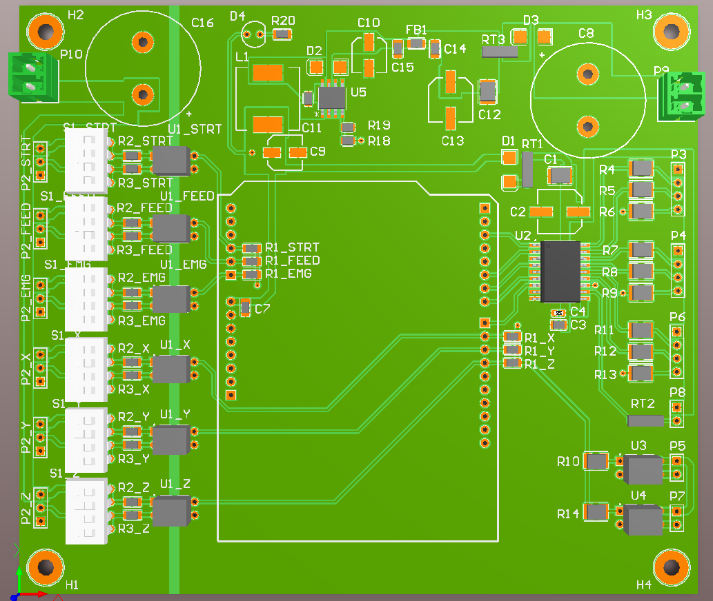
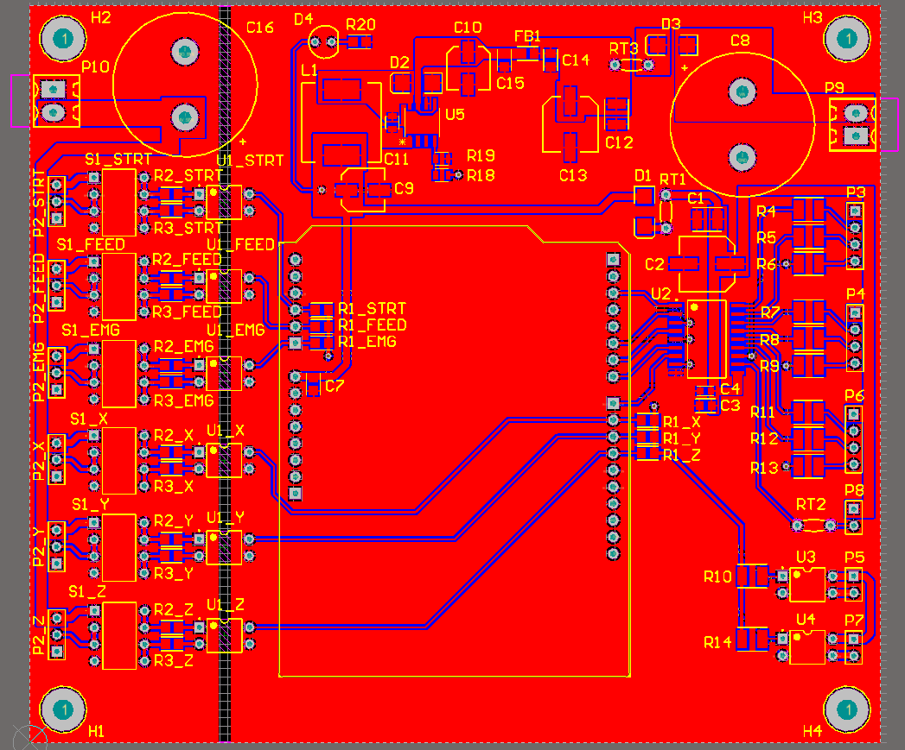

# 🛠️ Arduino Uno CNC Controller Shield

This project is an open-source CNC controller shield PCB designed for **Arduino Uno**, intended to be used with **Universal G-Code Sender** for controlling CNC machines.

---

<table>
  <tr>
    <td align="center">
      
    </td>
    <td align="center">
      
    </td>
  </tr>
</table>

## ✨ Specs

- **24V input**

- **Isolated 24V input for X, Y, Z limit sensors**

- **PNP / NPN selection via DIP switch**
  - Sensor type can be selected without hardware modification
  - Simply configure the onboard DIP switch

- **Opto-isolated inputs**
  - All inputs are electrically isolated using **optocouplers**

- **Integrated power regulation**
  - Onboard **buck converter**:
    - 24V → 12V

- **High-current output driver**
  - Based on **TBD62083** IC, with 500mA per channel

---

## 🤝 Contributions

Contributions, suggestions and improvements are welcome!
